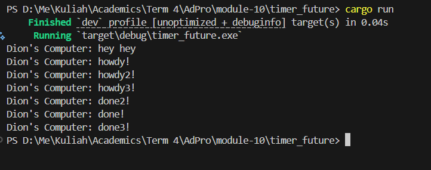
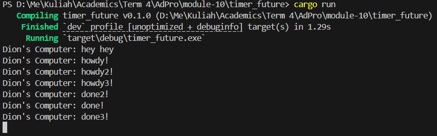

# Module 10

### 1.2 Print Task Explanation

The last print statement was executed first because the other two are spawned inside the executor as an async task. They would be called only if the `executor.run()` is called, which is located at the end of the function, meaning that they would be called last, after the "hey hey" statement.

### 1.3 Multiple Spawn

With Drop Spawn

Without Drop Spawn

Based on the output difference shown above, the run that doesn't drop the spawner would never stop. This is because in Rust, a channel is closed when all senders (Spawners in this case) are dropped. Without the drop spawner line, the executor thinks that new tasks could still be spawned. As a result, it keeps waiting for more work that doesn't exist, making the program run indefinitely.